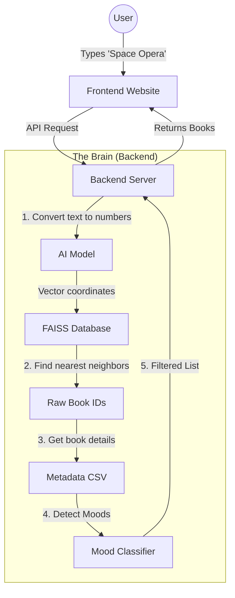

# 📘 Use-After-6-Months Guide: LLM Semantic Book Recommender

> **One-Sentence Summary:** This app lets users find books by describing a *vibe* or *plot* (e.g., "sad story about a robot") using AI to understand the meaning, not just keywords.

---

## 1. The Core Concept (Read This First)
If you forget everything else, remember this **Analogy**:

**Imagine a Library where books aren't sorted by author, but by "Meaning."**
*   In a normal library, "Harry Potter" is under 'R' (Rowling).
*   In *our* library, "Harry Potter" defines a location on a giant 3D map. "Percy Jackson" is right next to it because they are similar. "The Great Gatsby" is far away.
*   **The User's Search** ("Code") is also turned into a location on this map.
*   **The App's Job** is simply to find which books are closest to the user's search point.

### Key Terms Dictionary
*   **Embedding**: The process of turning text (a book description) into a list of numbers (coordinates on the map).
*   **Vector**: The list of numbers itself (e.g., `[0.1, -0.5, 0.8...]`).
*   **FAISS**: A super-fast tool from Facebook that stores these vectors and finds the closest ones in milliseconds.
*   **Cosine Similarity**: The math used to measure distance on the map.

---

## 2. Visual Architecture


---

## 3. How to Run It (The Cheat Sheet)
*Save these commands. They are all you need to start.*

### Prerequisites
*   Python 3.10+
*   Node.js 18+

### Step 1: Start the Backend (The API)
```bash
cd backend
# 1. Activate virtual environment (if you have one)
# .venv\Scripts\activate   (Windows)
# source .venv/bin/activate (Mac/Linux)

# 2. Run the server
uvicorn api.main:app --reload --port 8000
```
*   **Check it works**: Open `http://localhost:8000/docs` to see the API swagger.

### Step 2: Start the Frontend (The Website)
```bash
cd frontend
npm run dev
```
*   **Open App**: Go to `http://localhost:3000`.

---

## 4. Codebase Navigation (Where is everything?)

### 🧠 Backend (Python)
Located in `/backend`

| File | Challenge | Solution / Function |
| :--- | :--- | :--- |
| `api/main.py` | "I need to start the app." | The entry point. Sets up the API routes (`/api/search`). |
| `api/search.py` | "I need to change how search works." | **Crucial File**. Contains `search_books()`. This runs the AI model and FAISS search. |
| `data_pipeline/download_data.py` | "I deleted the data!" | Run this script to re-download the books from Kaggle. |

### 🎨 Frontend (React/Next.js)
Located in `/frontend`

| File | Challenge | Solution / Function |
| :--- | :--- | :--- |
| `app/page.tsx` | "I want to change the homepage layout." | The main file. Holds the `books` state and renders the grid. |
| `lib/api.ts` | "The frontend isn't talking to the backend." | Checks the API URL. Look here if you get connection errors. |
| `components/BookGrid.tsx` | "The book cards look ugly." | Controls how the list of books is displayed. |

---

## 5. Troubleshooting (Future You might need this)

**Problem**: "It says `Resources not found` when I start the backend."
**Fix**: You are missing the data.
1.  Run `python backend/data_pipeline/download_data.py`
2.  (If applicable) Run the script that generates the `faiss.index`.

**Problem**: "Search is slow."
**Fix**: FAISS is usually fast. Check if you are re-loading the model on every request. (It should only load once on startup in `lifespan`).

**Problem**: "I changed the code but nothing happened."
**Fix**:
*   Backend: Did you run with `--reload`? If not, restart the terminal.
*   Frontend: Refresh the browser.
